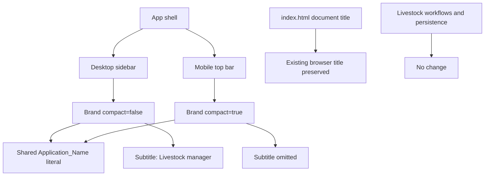

# Design Document: CSR Agro Ventures Application Name

## Overview

This feature changes the visible in-app application name from `csr agro` to exactly `CSR AGRO VENTURES` in the existing shared React `Brand` component. The same component supplies both the full desktop/sidebar presentation and the compact mobile/top-bar presentation, so one literal replacement is the intended implementation boundary.

The design deliberately preserves:

- the `compact` prop and its existing presentation-selection behavior;
- the full presentation subtitle source text, `Livestock manager`;
- omission of the subtitle from the compact presentation;
- the herd mark, component structure, classes, styling, responsive breakpoints, and layout behavior;
- the existing document title, `CSR Agro Ventures | Livestock Manager`;
- all livestock workflow, API, persistence, validation, and calculation behavior.

No server, database, API, domain-model, routing, or workflow changes are part of this feature. Application code implementation is outside this design phase.

### Design goals

1. Use one authoritative in-app name literal in the shared `Brand` component.
2. Render the exact required name in both supported Brand presentations.
3. Preserve all presentation branching and unrelated application behavior.
4. Verify the longer name remains visible without clipping or ellipsis at supported responsive layouts.
5. Make the change reviewable as a narrowly scoped presentation-only diff.

### Research findings

Repository research found:

- `client/src/App.jsx` defines one `Brand({ compact = false })` component whose `<strong>` currently contains `csr agro`.
- The same component is rendered as `<Brand />` in the sidebar and `<Brand compact />` in the mobile top bar. This makes a single text-node replacement sufficient for both presentations.
- The subtitle is already controlled by `!compact && <small>Livestock manager</small>`, so no conditional-rendering change is required.
- `client/index.html` already contains the required browser title and must remain unchanged.
- `client/src/styles.css` gives the two Brand presentations different icon and text sizes but applies no clipping or ellipsis rule to `.brand__words strong`. The longer text may wrap where space is constrained; visual checks must confirm that it remains fully visible and is not truncated.
- Neither the root package nor the client package currently defines a test script or test framework. Automated component tests therefore require separate test-tooling setup if implementation work includes them.

The component design follows React's existing conditional-rendering approach: keep the `compact` condition limited to subtitle presence and do not duplicate the component. Tests should query user-visible text rather than implementation-only selectors, consistent with Testing Library guidance.

References:

- Existing implementation: `client/src/App.jsx`, `client/src/styles.css`, and `client/index.html`
- [React: Conditional Rendering](https://react.dev/learn/conditional-rendering)
- [Testing Library: About Queries](https://testing-library.com/docs/queries/about/)

External guidance is summarized and rephrased for licensing compliance.

## Architecture

The feature remains within the client presentation layer.



### Change boundary

| Area | Design decision |
|---|---|
| `Brand` application-name text node | Replace `csr agro` with `CSR AGRO VENTURES`. |
| `Brand` component signature | Preserve `Brand({ compact = false })`. |
| Subtitle condition and source text | Preserve unchanged. |
| Herd mark and markup hierarchy | Preserve unchanged. |
| Brand CSS | No planned change. Only consider a minimal presentation fix during implementation if supported-viewport verification proves the required text is clipped or truncated. |
| Browser document title | Preserve unchanged. |
| Livestock feature code, API, and persistence | Preserve unchanged. |

A review should reject implementation changes outside this boundary unless they are strictly necessary to satisfy the non-truncation criterion and are separately justified.

## Components and Interfaces

### `Brand`

**Location:** `client/src/App.jsx`

**Existing interface:**

```text
Brand({ compact?: boolean = false }) -> React element
```

**Input semantics:**

- `compact = false`: render the Full_Brand_Presentation.
- `compact = true`: render the Compact_Brand_Presentation.

**Designed output contract:**

| Presentation | Herd mark | Application name | Subtitle |
|---|---:|---|---|
| Full | Present | Exactly one contiguous text node with `CSR AGRO VENTURES` | Exactly one source/DOM text value `Livestock manager` |
| Compact | Present | Exactly one contiguous text node with `CSR AGRO VENTURES` | Absent |

The existing subtitle CSS includes visual text transformation; this design preserves that styling while preserving the subtitle's source/DOM text as `Livestock manager`, matching the requirement to retain existing behavior.

### `Application_Document`

**Location:** `client/index.html`

The existing static `<title>` value is already `CSR Agro Ventures | Livestock Manager`. The feature does not introduce runtime title management and does not modify this file.

### Livestock workflow components and services

Pages and modules for purchases, inventory, sales, weights, profit, API access, validation, and persistence retain their existing interfaces and behavior. The application-name literal is not passed to or consumed by these layers.

## Data Models

This feature introduces no domain data or persistent state.

### Presentation constants

The relevant values are immutable presentation literals:

| Concept | Value | Persistence |
|---|---|---|
| `Application_Name` | `CSR AGRO VENTURES` | None; rendered literal |
| `Application_Subtitle` | `Livestock manager` | None; existing rendered literal |
| `Browser_Tab_Title` | `CSR Agro Ventures | Livestock Manager` | None; existing HTML title |
| `compact` | Boolean, default `false` | None; existing component prop |

No database migration, API schema change, state migration, serialization change, or cache invalidation is required.

## Correctness Properties

Randomized PBT is not appropriate for this feature. The change is deterministic UI rendering over only two exhaustively enumerable `compact` states, contains no parser, serializer, transformation algorithm, or broad input space, and adds no business logic. Running 100 randomized iterations would provide no additional confidence over two explicit component examples. The correctness statements below are therefore finite, exhaustively testable invariants rather than randomized PBT properties; verification uses example-based component tests, visual checks, and existing workflow regression tests.

### Property 1: Full Brand

For the full presentation, the rendered Brand contains exactly one Application_Name text node whose `textContent` equals `CSR AGRO VENTURES`, and exactly one subtitle whose `textContent` equals `Livestock manager`.

**Validates: Requirements 1.1, 2.1**

### Property 2: Compact Brand

For the compact presentation, the rendered Brand contains exactly one Application_Name text node whose `textContent` equals `CSR AGRO VENTURES` and contains no subtitle.

**Validates: Requirements 1.2, 2.2**

### Property 3: Document Title

After loading the application document, `document.title` equals `CSR Agro Ventures | Livestock Manager`.

**Validates: Requirements 3.1**

### Property 4: Presentation-Only Change

Comparing representative pre-update and post-update workflows with identical initial records and inputs, only the in-app Application_Name differs; completion status, displayed operational values, validation results, and persisted records remain equal.

**Validates: Requirements 4.1, 4.2, 4.3**

## Error Handling

The feature adds no new runtime operation and therefore no new recoverable error path.

- An incorrect literal, duplicate name, missing subtitle, unexpected compact subtitle, or changed browser title is a build-time/test-time regression and should fail verification.
- Clipping, ellipsis, or unreadable wrapping of the longer name is a visual acceptance failure. The implementation should first preserve existing CSS; if a failure is observed at a supported viewport, apply only the smallest Brand-specific style adjustment and repeat responsive checks.
- Any changed livestock workflow result, validation behavior, or persisted record is a release-blocking regression. The text change must be reverted or corrected rather than handled at runtime.
- No fallback label is introduced because it could violate the exact-string requirement and conceal an implementation defect.

## Testing Strategy

Testing uses exhaustive examples for both Brand states plus regression checks. If automated component-test tooling is added during implementation, use Vitest with React Testing Library and `@testing-library/jest-dom`; query the visible string with text-oriented queries and inspect the rendered element's exact `textContent` where case and spacing matter.

### Component tests

- Render `<Brand />`; assert one exact application-name match and one exact subtitle match.
- Render `<Brand compact />`; assert one exact application-name match and assert the subtitle is absent.
- Use exact, case-sensitive matching. Do not use a case-insensitive expression that would allow `csr agro ventures` or additional characters.
- Assert the application name is one element/text node, preventing a test from passing when words are duplicated or split across unrelated elements.
- Retain a negative assertion that the legacy exact text `csr agro` is not rendered by either Brand state.

Because `Brand` is currently local to `App.jsx`, implementation may either test it through the rendered app shell or make the smallest testability-preserving export change. Extracting or redesigning the component solely for this literal replacement is not required.

### Document test

Load `client/index.html` through the normal client build or a DOM fixture and assert the exact document title. This is a preservation test: implementation should not edit the title.

### Responsive and visual checks

Check at least these contexts:

- desktop sidebar above the mobile breakpoint;
- constrained sidebar near the `940px` breakpoint;
- compact mobile top bar at and below the `720px` breakpoint;
- a narrow supported mobile viewport.

For each visible Brand instance, confirm the full name is readable, fully visible, and has no clipping or ellipsis. Wrapping is acceptable only if all characters remain visible and the result meets the existing layout's usability expectations; no acceptance assertion may rely only on a screenshot when exact DOM text can be tested directly.

### Functional regression checks

Use representative existing workflows for purchases, inventory, sales, weight records, and profit information:

- replay valid examples against the same known initial records and compare completion status and displayed values with the pre-update baseline;
- compare created or updated records field-for-field with the baseline;
- replay representative invalid inputs and verify the validation failure remains visible and record state remains unchanged;
- verify no request payload, endpoint interaction, calculation output, or database field is affected by the brand text.

These are regression/integration checks rather than new behavior tests. Existing automated tests should remain unchanged and pass; where no automated suite exists, record the manual baseline and comparison evidence for review.

### Build and review gates

1. Run the non-watch client production build (`npm run build --workspace=client`).
2. Run component/document tests once if test tooling is available (for example, Vitest in run mode, never watch mode).
3. Inspect the final diff and confirm the intended application-code change is limited to the Brand name literal, unless a minimal Brand-only style fix was proven necessary.
4. Search client source for the legacy in-app literal and verify no rendered `csr agro` occurrence remains.
5. Confirm `client/index.html` and server/database files are unchanged.

## Requirements Traceability

| Requirement | Design coverage | Verification |
|---|---|---|
| 1.1 Full name | Shared Brand output contract; full presentation | Full Brand component test; desktop visual check |
| 1.2 Compact name | Shared Brand output contract; compact presentation | Compact Brand component test; mobile visual check |
| 2.1 Full subtitle | Existing `!compact` branch and subtitle literal preserved | Full Brand component test |
| 2.2 Compact subtitle omission | Existing `!compact` branch preserved | Compact Brand negative assertion |
| 3.1 Browser title | Existing static document title preserved | Exact `document.title` assertion |
| 4.1 Workflow status and values | Presentation-only architecture boundary | Representative workflow baseline comparison |
| 4.2 Persisted records | No API, server, database, or model changes | Field-for-field persistence regression comparison |
| 4.3 Invalid-input behavior | Validation paths outside change boundary | Invalid-input regression and unchanged-state assertion |

All acceptance criteria are covered. If implementation reveals that exact subtitle capitalization is intended to describe computed visual casing rather than the preserved source/DOM value, or that supported viewport wrapping needs a stricter rule, return to requirements clarification before broadening the change.