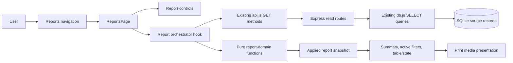
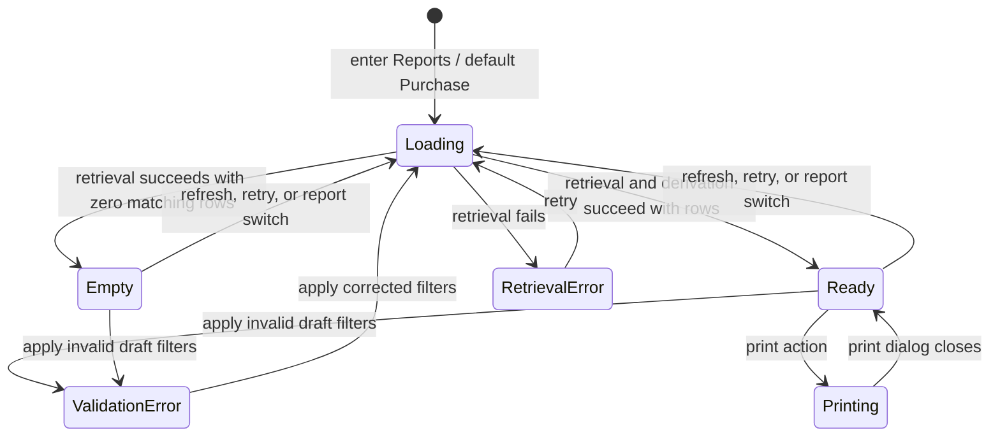

# Livestock Reporting Design

## Overview

The livestock reporting feature adds a read-only `Reports` destination to the existing React/Vite client. It presents Purchase, Sales, and Animal Weight reports from fresh snapshots returned by the existing Express read APIs. Report-specific pure functions validate filters, select and order rows, and derive summaries; React components render the resulting immutable report view and browser print styles produce a printable representation of that same applied result.

The design deliberately does not add write routes, database tables, or report persistence. It keeps reports consistent with operational records by fetching the selected record collection when a report is entered, selected, refreshed, or retried, then deriving one view from that response snapshot. Draft filter values are distinct from applied filters so invalid input cannot replace the most recent valid result.

### Goals

- Add one Reports navigation module whose initial report type is Purchase.
- Apply inclusive date filtering, case-insensitive substring text filtering, and exact case-insensitive animal tag filtering.
- Produce deterministic ordered rows and summaries solely from the current valid filtered set.
- Preserve the most recent valid result while draft filters are invalid.
- Support responsive on-screen access and a print-only rendering of the current non-empty valid result.
- Keep all reporting behavior read-only with respect to purchase, sale, and weight records.

### Non-goals

- Editing, deleting, or creating source records from Reports.
- Persisting report definitions or generated output.
- CSV, spreadsheet, or other data-file export.
- Adding aggregate/report tables to SQLite.
- Changing purchase, sale, inventory, or weight-entry workflows.

### Research and design findings

Repository research found that the current API payloads already contain all required report data:

- `GET /api/purchases` includes source fields plus `totalCost` and `landedUnitCost`, ordered by purchase date and ID descending.
- `GET /api/sales` joins purchases and includes source batch, species, breed, `revenue`, `cost`, and `profit`, ordered by sale date and ID descending.
- `GET /api/weights` joins purchases and includes tag, measurement type, livestock details, notes, and ID, ordered by measurement date and ID descending.
- The SQLite queries calculate landed cost as `unit_cost + transport_cost / quantity` and sale cost/profit from that source-batch landed cost.
- The existing `.table-wrap` convention uses horizontal overflow and a table minimum width, providing a suitable responsive pattern.

Consequently, focused report endpoints would duplicate existing SQL and contracts without improving correctness for this local application. The client will reuse the three GET endpoints and filter their fresh response snapshots in memory. If record volumes later make full collection retrieval unsuitable, compatible server-side query parameters may be introduced without changing the report-domain functions or view contracts.

For printing, browser-native print invocation and print media CSS are appropriate: [MDN's printing guidance](https://developer.mozilla.org/en-US/docs/Web/CSS/Guides/Media_queries/Printing) describes using print media rules to produce a paper/PDF-specific presentation, while [CSS paged media](https://developer.mozilla.org/en-US/docs/Web/CSS/Guides/Paged_media) covers page sizing and fragmentation. For JavaScript property testing, [fast-check](https://fast-check.dev/) integrates with standard test runners, and its [configuration documentation](https://fast-check.dev/docs/configuration/) supports explicit run counts and reproducible seeds.

Content from external sources was rephrased for compliance with licensing restrictions.

## Architecture

The feature follows the existing three-layer architecture and adds no new persistence layer.



### Architectural decisions

1. **Reuse existing read endpoints.** `api.getPurchases()`, `api.getSales()`, and `api.getWeights()` provide the complete row contracts. This avoids report-only SQL drift, especially for landed cost and realized profit.
2. **Separate retrieval from derivation.** The API adapter obtains a source snapshot; pure functions validate, filter, sort, and summarize it. This makes business rules independently testable and prevents rendering code from becoming the source of truth.
3. **Separate draft and applied state.** Controls edit `draftFilters`. Only a valid apply operation updates `appliedFilters` and `lastValidReport`. An invalid date range or missing animal tag sets validation state but leaves the valid rows and summary untouched.
4. **Use a request-generation token.** Each retrieval receives an increasing request ID. Only the latest request for the currently selected report may commit its result, preventing a slower previous request from replacing a newer selection or retry.
5. **Print the same applied snapshot.** Printing does not refetch or recalculate. The printable DOM is derived from `lastValidReport`, ensuring displayed filters, summary, and rows agree.
6. **Keep the module read-only by construction.** Reports receives only GET-capable data adapters and no create/delete callbacks. Source arrays are treated as immutable and domain functions return new arrays and summary objects.
7. **Make chronology explicit.** Descending row order and weight summary chronology both compare ISO date first and integer record ID second. For equal dates, greater ID is later.

### Report lifecycle



`ValidationError` retains `lastValidReport` internally but presents the validation message and disables printing until valid filters are applied. `RetrievalError` presents retry and disables printing. Switching report type initializes that report's empty draft filters, makes Purchase the first type only on initial module entry, and retrieves the selected source collection.

### Data flow

1. The user enters Reports; `reportType` initializes to `purchase`.
2. The orchestrator validates the selected type's filters. Purchase and Sales empty filters are valid; Weight requires a non-empty tag.
3. For a valid request, the adapter calls exactly one existing endpoint for the selected report type.
4. The response is captured as `sourceRows`; no source object is modified.
5. The domain pipeline applies all populated predicates with AND semantics, creates a new deterministically sorted array, and calculates a summary from that array only.
6. React commits one `AppliedReport` containing type, normalized applied filters, rows, summary, and generation timestamp.
7. The screen and print presentation both consume that same object.

## Components and Interfaces

### Client modules

#### Navigation integration

Add `{ id: 'reports', label: 'Reports', icon: 'reports' }` to the shared navigation and report page copy. Both desktop and mobile navigation use the existing `NavItems` path. The mobile grid must account for the additional item without removing access to any existing destination.

#### `ReportsPage`

Owns report-type selection and composes controls, status content, summary, table, and print action.

```js
ReportsPage({ reportDataSource, now = () => new Date(), print = () => window.print() })
```

Responsibilities:

- Initialize `reportType` to `purchase` when mounted.
- Render the three report-type controls with accessible selected state.
- Delegate draft filter editing and apply/clear actions.
- Render active applied filters, summary, and rows together.
- Route retry and refresh to the same retrieval pipeline.
- Enable print only in `ready` state with at least one row.
- Expose no record-management actions.

#### `useReportController`

Coordinates state and asynchronous retrieval while leaving report calculations pure.

```ts
type ReportStatus =
  | 'idle'
  | 'loading'
  | 'ready'
  | 'empty'
  | 'validation-error'
  | 'retrieval-error';

interface ReportController {
  reportType: ReportType;
  draftFilters: ReportFilters;
  lastValidReport: AppliedReport | null;
  status: ReportStatus;
  error: ReportError | null;
  selectReport(type: ReportType): void;
  updateFilter(name: string, value: string): void;
  applyFilters(): Promise<void>;
  clearFilters(): Promise<void>;
  refresh(): Promise<void>;
  retry(): Promise<void>;
  printCurrent(): void;
}
```

`retry()` repeats retrieval for the selected report and the currently active valid filter set. If the draft set is invalid, the controller uses the last applied valid set rather than sending invalid state through the pipeline.

#### `ReportTypeSelector`

A tablist or equivalently accessible selection control with Purchase, Sales, and Animal Weight options. Selection changes the controls, summary schema, and table schema as one operation and starts a fresh retrieval.

#### Filter components

- `PurchaseReportFilters`: optional `startDate`, `endDate`, `supplier`, `species`, `breed`.
- `SalesReportFilters`: optional `startDate`, `endDate`, `customer`, `species`, `breed`.
- `WeightReportFilters`: required `animalTag`, optional `startDate`, `endDate`, `measurementType`.

Each component emits strings only and displays field-associated validation. Apply validates before retrieval. Clear resets every field, including the required weight tag, then leaves the Weight report in a required-tag validation state with an empty visible field.

#### `ActiveFilterSummary`

Renders only populated applied filters using human-readable labels. This component appears on screen and remains visible in print. An unfiltered Purchase or Sales report states `All records` so the applied scope is unambiguous.

#### `ReportSummary`

Uses type-specific summary definitions:

- Purchase: record count, purchased quantity, total purchase cost.
- Sales: record count, sold quantity, total sales revenue, realized profit.
- Weight: record count, earliest measurement/date, latest measurement/date, weight change or `Unavailable — one measurement`.

#### `ReportTable`

Uses a selected column definition and the existing horizontally scrollable table wrapper. Every cell remains in the DOM at narrow widths; columns are not hidden. Row keys use record IDs. The wrapper receives an accessible label indicating horizontal scrolling when needed.

Column sets:

- Purchase: batch ID, purchase date, supplier, species, breed, quantity, unit cost, transport cost, total cost.
- Sales: sale ID, sale date, customer, source batch, species, breed, quantity, unit price, revenue, cost, profit.
- Weight: animal tag, measurement date, measurement type, weight (kg), source batch, species, breed, notes.

#### `ReportStatePanel`

Renders mutually exclusive state content:

- `loading`: selected report loading message.
- `empty`: selected report name plus guidance to adjust or clear filters.
- `validation-error`: actionable date-order or required-tag message.
- `retrieval-error`: data-load failure message and Retry button.

#### `PrintableReport`

A semantic section within the page sourced from `lastValidReport`. Print CSS makes it the printable region and includes title, generation date, populated applied filters, summary, and all filtered rows. `thead { display: table-header-group; }` repeats headings where supported; rows use `break-inside: avoid`. `@page` defines practical margins. Navigation, filter controls, retry/refresh buttons, management controls, and screen-only notices are hidden under `@media print`. The print button invokes `window.print()` only after the valid non-empty guard passes.

### Data source interface

No focused report endpoint is introduced. A thin adapter limits the controller to read operations:

```ts
interface ReportDataSource {
  retrieve(type: ReportType): Promise<readonly ReportSourceRow[]>;
}

const reportDataSource = {
  retrieve(type) {
    if (type === 'purchase') return api.getPurchases();
    if (type === 'sales') return api.getSales();
    return api.getWeights();
  },
};
```

The adapter must not expose `create*` or `delete*` methods. Existing Express routes and SQLite query functions remain unchanged. A retrieval call is logically associated with the selected report and applied valid filters even though filtering occurs immediately after the endpoint returns.

### Pure report-domain interfaces

```ts
type ReportType = 'purchase' | 'sales' | 'weight';
type MeasurementType = '' | 'weekly' | 'monthly';

interface DateRange {
  startDate: string; // empty or YYYY-MM-DD
  endDate: string;   // empty or YYYY-MM-DD
}

interface PurchaseFilters extends DateRange {
  supplier: string;
  species: string;
  breed: string;
}

interface SalesFilters extends DateRange {
  customer: string;
  species: string;
  breed: string;
}

interface WeightFilters extends DateRange {
  animalTag: string;
  measurementType: MeasurementType;
}

type ReportFilters = PurchaseFilters | SalesFilters | WeightFilters;

interface ValidationResult<T> {
  valid: boolean;
  normalized?: T;
  errors: Readonly<Record<string, string>>;
}

validateFilters(type: ReportType, filters: ReportFilters): ValidationResult<ReportFilters>;
filterPurchaseRows(rows: readonly PurchaseRow[], filters: PurchaseFilters): PurchaseRow[];
filterSalesRows(rows: readonly SalesRow[], filters: SalesFilters): SalesRow[];
filterWeightRows(rows: readonly WeightRow[], filters: WeightFilters): WeightRow[];
summarizePurchases(rows: readonly PurchaseRow[]): PurchaseSummary;
summarizeSales(rows: readonly SalesRow[]): SalesSummary;
summarizeWeights(rows: readonly WeightRow[]): WeightSummary;
buildReport(type, sourceRows, normalizedFilters, generatedAt): AppliedReport;
```

Filtering rules:

- ISO `YYYY-MM-DD` strings are compared lexicographically after validation; start and end comparisons are inclusive.
- Optional text predicates normalize both filter and field with trim plus case folding, then use substring inclusion.
- Animal tag normalizes both values with trim plus case folding, then uses equality, never substring matching.
- Measurement type uses exact enum equality when populated.
- Every populated predicate must pass for inclusion.
- Source arrays and source objects are never sorted or modified in place.

Ordering rules:

```js
const descendingChronology = (dateField) => (a, b) =>
  b[dateField].localeCompare(a[dateField]) || b.id - a.id;
```

Purchase rows use `purchaseDate`, Sales rows use `saleDate`, and Weight rows use `weightDate`. Weight summary extrema use ascending `(weightDate, id)` chronology: the lower ID is earliest and greater ID is latest when dates are equal.

### Server and persistence boundaries

The module calls only:

- `GET /api/purchases`
- `GET /api/sales`
- `GET /api/weights`

The existing server projections remain authoritative for database joins and per-row accounting:

- Purchase `totalCost = quantity × unitCost + transportCost`.
- Purchase `landedUnitCost = unitCost + transportCost ÷ quantity`.
- Sale `revenue = quantity × unitPrice`.
- Sale `cost = quantity × source purchase landedUnitCost`.
- Sale `profit = revenue − cost`.

No POST, DELETE, UPDATE, INSERT, or report cache operation participates in report generation.

## Data Models

### Source row contracts

```ts
interface PurchaseRow {
  id: number;
  purchaseDate: string;
  supplier: string;
  species: string;
  breed: string;
  quantity: number;
  unitCost: number;
  transportCost: number;
  totalCost: number;
  landedUnitCost: number;
}

interface SalesRow {
  id: number;
  saleDate: string;
  customer: string;
  purchaseId: number;
  species: string;
  breed: string;
  quantity: number;
  unitPrice: number;
  revenue: number;
  cost: number;
  profit: number;
}

interface WeightRow {
  id: number;
  animalTag: string;
  weightDate: string;
  measurementType: 'weekly' | 'monthly';
  weightKg: number;
  purchaseId: number;
  species: string;
  breed: string;
  notes: string;
}
```

These are projections of existing persisted records. Reports must not append display-only fields to source objects; formatting occurs at render time.

### Summary contracts

```ts
interface PurchaseSummary {
  recordCount: number;
  purchasedQuantity: number;
  totalPurchaseCost: number;
}

interface SalesSummary {
  recordCount: number;
  soldQuantity: number;
  totalSalesRevenue: number;
  realizedProfit: number;
}

interface WeightPoint {
  id: number;
  date: string;
  weightKg: number;
}

interface WeightSummary {
  recordCount: number;
  earliest: WeightPoint | null;
  latest: WeightPoint | null;
  weightChange: number | null;
  comparisonAvailable: boolean;
}
```

For no weight rows, both extrema and change are null. For one row, earliest and latest identify that row while `comparisonAvailable` is false and change is null. For two or more rows, change is `latest.weightKg - earliest.weightKg`. Numeric values remain numbers in domain state and are formatted only at the view boundary using existing locale/currency formatters.

### Applied report snapshot

```ts
interface AppliedReport {
  type: ReportType;
  appliedFilters: Readonly<ReportFilters>;
  rows: readonly ReportSourceRow[];
  summary: Readonly<PurchaseSummary | SalesSummary | WeightSummary>;
  generatedAt: string; // ISO timestamp captured once per successful retrieval
  sourceRequestId: number;
}

interface ReportError {
  kind: 'validation' | 'retrieval';
  message: string;
  fieldErrors?: Readonly<Record<string, string>>;
  retryable: boolean;
}
```

`AppliedReport` is replaced atomically after successful retrieval and derivation. Its filters, rows, summary, and generation date therefore cannot represent different requests.

### State invariants

- `ready` implies a valid applied filter set and `rows.length > 0`.
- `empty` implies a valid applied filter set and `rows.length === 0`.
- `validation-error` and `retrieval-error` imply printing is disabled.
- `lastValidReport`, if present, was created only from a successful retrieval and valid filters.
- Every summary is a function only of its sibling `rows` collection.
- Weight rows all exactly match the normalized required animal tag.
- A committed response belongs to the latest request ID and currently selected report type.
- Report state contains no callback capable of mutating source records.

### Property-based testing applicability assessment

Property-based testing is appropriate for the pure validation, filtering, ordering, and summary functions because their behavior varies across large combinations of dates, text, IDs, quantities, and prices. Universal invariants, exact-set membership, deterministic ordering, source immutability, accounting formulas, and chronology tie-breaking are cost-effective to exercise in memory. UI rendering, browser printing, endpoint wiring, and retry interaction are instead covered by example-based component and integration tests.

## Correctness Properties

*A property is a characteristic or behavior that should hold true across all valid executions of a system-essentially, a formal statement about what the system should do. Properties serve as the bridge between human-readable specifications and machine-verifiable correctness guarantees.*

### Property 1: Report derivation preserves source records

For all valid Purchase, Sales, and Weight source-row collections and valid filter sets, deriving a report leaves the source arrays and every source object structurally equal to their pre-derivation values.

**Validates: Requirements 1.4**

### Property 2: Date ranges have inclusive optional boundaries

For all valid report rows and valid combinations of absent or populated date boundaries, a row passes the date predicate exactly when its date is greater than or equal to a populated start date and less than or equal to a populated end date; a row on either populated boundary is included.

**Validates: Requirements 5.1, 5.2, 5.3**

### Property 3: Purchase filtering returns exactly the conjunctive match set

For all Purchase row collections and valid Purchase filter sets, the filtered result contains every and only row whose date satisfies the inclusive range and whose supplier, species, and breed each contain the corresponding populated, trimmed filter text without case sensitivity.

**Validates: Requirements 2.2, 2.3**

### Property 4: Purchase rows follow deterministic descending chronology

For all Purchase row collections, filtering and ordering preserves exactly the matching row IDs and places every adjacent pair in descending purchase-date order, using descending batch ID when the dates are equal.

**Validates: Requirements 2.8**

### Property 5: Purchase summary is the exact reduction of filtered rows

For all filtered Purchase row collections, the summary record count equals the collection length, purchased quantity equals the sum of row quantities, and total purchase cost equals the sum of `quantity × unitCost + transportCost` across exactly those rows.

**Validates: Requirements 2.5, 2.6, 2.7, 7.2**

### Property 6: Sales filtering returns exactly the conjunctive match set

For all Sales row collections and valid Sales filter sets, the filtered result contains every and only row whose date satisfies the inclusive range and whose customer, species, and breed each contain the corresponding populated, trimmed filter text without case sensitivity.

**Validates: Requirements 3.2, 3.3**

### Property 7: Sales rows follow deterministic descending chronology

For all Sales row collections, filtering and ordering preserves exactly the matching row IDs and places every adjacent pair in descending sale-date order, using descending sale ID when the dates are equal.

**Validates: Requirements 3.9**

### Property 8: Sales summary is the exact accounting reduction of filtered rows

For all filtered Sales row collections conforming to the existing API contract, the summary record count equals the collection length, sold quantity equals the quantity sum, total sales revenue equals the sum of `quantity × unitPrice`, and realized profit equals the sum of `revenue − cost` across exactly those rows.

**Validates: Requirements 3.5, 3.6, 3.7, 3.8, 7.3**

### Property 9: Weight filtering requires an exact normalized tag and all optional predicates

For all Weight row collections and valid Weight filter sets, the filtered result contains every and only row whose trimmed animal tag equals the trimmed required tag without case sensitivity, whose date satisfies the inclusive range, and whose measurement type equals the populated type; tag prefixes and other substrings do not match.

**Validates: Requirements 4.2**

### Property 10: Weight rows follow deterministic descending chronology

For all Weight row collections, filtering and ordering preserves exactly the matching row IDs and places every adjacent pair in descending measurement-date order, using descending Weight record ID when the dates are equal.

**Validates: Requirements 4.9**

### Property 11: Weight summary uses deterministic chronological extrema

For all filtered Weight row collections, the summary count equals the collection length; an empty collection has no extrema or change; a one-row collection uses that row as both extrema and marks comparison unavailable; and a collection of at least two rows selects the minimum and maximum `(measurementDate, id)` pairs and reports latest weight minus earliest weight, treating the greater ID as later when dates are equal.

**Validates: Requirements 4.4, 4.5, 4.6, 4.7, 4.8, 7.5, 7.6**

### Property 12: Invalid date ranges cannot replace the last valid report

For all controller states containing any last valid applied report and all draft filter sets whose start date is later than their end date, applying the draft produces a date-order validation error and leaves the last valid applied filters, rows, summary, generation timestamp, and request ID unchanged.

**Validates: Requirements 5.4, 5.5**

## Error Handling

### Validation errors

Validation runs before any retrieval request:

| Condition | Result | Recovery |
| --- | --- | --- |
| Start date is later than end date | Set `validation-error` with “Start date must be on or before end date”; do not issue GET; preserve `lastValidReport` | Correct either boundary and Apply |
| Weight tag is empty or whitespace | Set `validation-error` with “Animal ID / tag is required”; do not issue GET | Enter an ID/tag and Apply |
| Unexpected measurement type reaches domain boundary | Reject as invalid filter state; do not retrieve | Select Weekly, Monthly, or All |

Native date inputs constrain syntax. The domain validator still treats non-empty malformed date strings as invalid so tests and programmatic calls cannot bypass the contract. Validation messages are associated with their fields and summarized in an alert region. Validation errors disable print even when a previous valid snapshot is retained internally.

### Retrieval errors

Any rejected existing GET request produces `retrieval-error` with a stable user-facing message: “Report data could not be loaded.” The panel includes Retry; technical details are not exposed. Retry increments the request ID and repeats the selected report retrieval using the active valid filter set. A failed request never partially updates rows, summary, filters, or generation time.

If an older request resolves after a report switch, refresh, or retry, its request ID/type mismatch causes it to be ignored. This is not shown as an error because a newer user intent supersedes it.

### Empty results

A successful retrieval and valid derivation with zero rows produces `empty`, not an error. The state names the selected report and recommends adjusting or clearing filters. Active filters remain visible so the user can understand the empty scope. Print is disabled.

### Calculation and data defenses

- Report-domain functions accept only finite numeric quantity, weight, and monetary fields from the API contract. A malformed row should fail derivation and surface as a retrieval/data error rather than display misleading totals.
- Summaries do not infer missing sales cost from unrelated client inventory. Existing sales projections remain authoritative for source-batch landed cost.
- Empty purchase and sales sets return numeric zero summaries.
- Weight change remains unavailable for fewer than two records.
- Currency and weight formatting occurs only after calculations to avoid arithmetic on localized strings.
- Floating-point values retain the existing application/SQLite behavior; display uses two decimal places. Tests compare accounting values with an appropriate decimal tolerance rather than formatted text equality.

### Print safeguards

`printCurrent()` rechecks that status is `ready`, the snapshot exists, and rows are non-empty before invoking the browser. The print region is never sourced from draft filters. Browser print cancellation is not an application error and leaves report state unchanged.

## Testing Strategy

The feature uses a dual testing approach: focused unit/component tests verify examples, boundaries, and UI state transitions, while property tests verify universal report-domain behavior over generated inputs. Integration and visual checks cover API freshness, responsive access, and browser printing where random in-memory tests are not appropriate.

### Test tooling

- **Vitest** for unit and component test execution in the Vite client.
- **React Testing Library** plus `user-event` for accessible control, state, retry, and print-action tests.
- **fast-check** for JavaScript property-based tests. Each correctness property runs at least 100 generated cases through `fc.assert(..., { numRuns: 100 })`; a higher shared default is acceptable.
- A browser automation tool for viewport overflow and print-media checks if one is adopted by the project; otherwise retain a documented manual print-preview checklist alongside automated CSS assertions.
- Server integration tests use a temporary SQLite database selected with `DATABASE_PATH` and the Express app without starting a long-running development server.

Dependencies introduced during implementation must be pinned to exact versions compatible with the existing Node 22.12+, React 19, and Vite 8 toolchain.

### Property tests

Each design property is implemented by exactly one fast-check property test. Every test includes a comment in this exact form immediately above the assertion:

```js
// Feature: livestock-reporting, Property 3: Purchase filtering returns exactly the conjunctive match set
```

Generators produce valid ISO dates, unique positive IDs, optional text with case/whitespace variations, duplicate dates, finite bounded quantities and monetary values, and shuffled arrays. Reference implementations should be intentionally simple. Input records are deep-frozen for immutability checks. Failed seeds and shrunk counterexamples are retained in test output for reproduction.

Property-to-test mapping:

| Property | Primary generated behavior |
| --- | --- |
| 1 | Frozen source collections remain unchanged for all three pipelines |
| 2 | Absent, one-sided, and two-sided inclusive ranges across date fields |
| 3 | Purchase AND semantics and normalized substring matching |
| 4 | Purchase descending `(purchaseDate, id)` ordering |
| 5 | Purchase count, quantity, and total-cost reference reduction |
| 6 | Sales AND semantics and normalized substring matching |
| 7 | Sales descending `(saleDate, id)` ordering |
| 8 | Sales count, quantity, revenue formula, and API-projected `revenue − cost` profit reduction |
| 9 | Exact normalized weight tag, date, and measurement-type predicates |
| 10 | Weight descending `(weightDate, id)` ordering |
| 11 | Zero/one/many chronology, same-date ID extrema, and weight change |
| 12 | Invalid date transition preserves arbitrary last-valid snapshots |

### Unit and component tests

Use representative examples rather than duplicating the generated property coverage:

- Reports opens with Purchase selected and exposes all three report choices.
- Each type displays exactly its required filters, summary labels, and column headings.
- Purchase and Sales empty filter sets are valid; Weight requires a non-whitespace tag.
- One Weight row displays earliest/latest and an unavailable change message.
- Clear resets every optional field; Weight clear also empties but retains the required tag input.
- Empty states name Purchase, Sales, or Animal Weight and recommend adjusting/clearing filters.
- Date-order and missing-tag messages are field-associated, preserve the valid snapshot, and disable print.
- Retrieval failure shows the stable error message and Retry; activating Retry calls the adapter again.
- A stale request resolution cannot replace the latest report selection/request.
- Print is enabled only for `ready` with non-empty rows and calls `window.print()` once.
- The print region includes title, captured generation date, populated applied filters, summary, and all applied rows while omitting unpopulated filters.
- Report tables include all required values and no edit/delete controls.

### API and database integration tests

- Seed purchases, sales, and weights in a temporary SQLite database and verify the three existing GET payloads satisfy the source-row contracts.
- Verify sales cost and profit use the linked purchase batch's landed unit cost.
- Change source data between two retrievals and verify refresh derives from the later response snapshot.
- Simulate a rejected adapter request followed by success and verify Retry creates a new request and commits only the successful snapshot.
- Confirm report interactions generate only GET requests; no source row counts or values change before versus after report generation and printing.

### Responsive, accessibility, and print tests

- At desktop and narrow mobile widths, assert the table wrapper is horizontally scrollable and every required column remains rendered; do not hide columns with responsive CSS.
- Verify type selection uses accessible names/state, form fields have labels, validation uses an alert region, and loading/status updates are announced appropriately.
- Assert print CSS hides sidebar, mobile navigation, top navigation, filter controls, retry/refresh/print controls, and management actions.
- Assert print CSS displays the report title, generation date, filters, summary, complete table, `thead` as a table header group, and rows with page-break protection.
- Perform a print-preview smoke test with enough rows for multiple pages in each report type, checking repeated headings, readable landscape/portrait behavior, no clipped columns, and practical page margins.

### Requirement traceability

| Requirements | Design elements | Verification |
| --- | --- | --- |
| 1.1–1.3 | Navigation integration, `ReportsPage`, `ReportTypeSelector`, schema-driven controls/summary/table | Component tests |
| 1.4 | Read-only adapter, immutable domain pipeline, no mutation callbacks | Property 1; API/database non-mutation integration test |
| 2.1, 2.4 | `PurchaseReportFilters`, Purchase columns | Component tests |
| 2.2–2.3 | Purchase predicate pipeline | Property 3 |
| 2.5–2.7, 7.2 | `summarizePurchases` | Property 5 |
| 2.8 | Purchase chronology comparator | Property 4 |
| 3.1, 3.4 | `SalesReportFilters`, Sales columns | Component tests |
| 3.2–3.3 | Sales predicate pipeline | Property 6 |
| 3.5–3.8, 7.3 | `summarizeSales` over the existing sales projection | Property 8 |
| 7.4 | Existing SQLite sales projection joins each sale to its source purchase landed cost | Server integration test |
| 3.9 | Sales chronology comparator | Property 7 |
| 4.1, 4.3 | `WeightReportFilters`, Weight columns | Component tests |
| 4.2 | Weight predicate pipeline | Property 9 |
| 4.4–4.8, 7.5–7.6 | `summarizeWeights`, `(weightDate, id)` extrema | Property 11; one-row component test |
| 4.9 | Weight chronology comparator | Property 10 |
| 5.1–5.3 | Shared date predicate | Property 2 |
| 5.4–5.6 | Validator and draft/applied state separation | Property 12; edge-case unit tests |
| 5.7 | `ReportStatePanel` empty state | Component tests |
| 5.8–5.9 | Retrieval error state and controller Retry | Component and adapter integration tests |
| 5.10–5.11 | Type-specific clear behavior | Component tests |
| 6.1 | Applied snapshot composition | Component test |
| 6.2 | Existing horizontal table-wrap pattern | Responsive browser test |
| 6.3–6.7 | Print guard and `PrintableReport` from applied snapshot | Component/print-region integration tests |
| 6.8–6.9 | Print media/paged styles | Automated CSS assertions and multi-page print-preview smoke test |
| 6.10 | State-derived print enablement | Parameterized component tests |
| 7.1 | Fresh per-report retrieval and atomic applied snapshot | Temporary-database integration test |

### Validation gates

Implementation is complete only when:

1. All 12 property tests pass with at least 100 runs each.
2. Unit/component tests cover every example and edge case listed above.
3. Temporary-database integration tests verify freshness, accounting joins, retry, and non-mutation.
4. The client production build succeeds.
5. Responsive and multi-page print-preview checks pass for all three report types.
